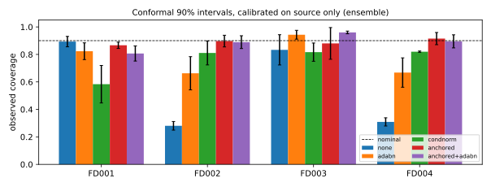
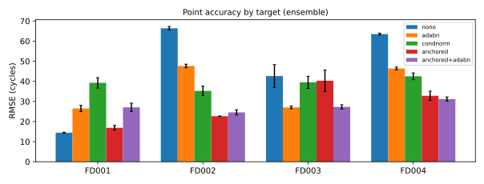

# shift-aware-rul

**Calibrated remaining-useful-life (RUL) prediction when operating conditions shift: what test-time adaptation does to accuracy *and* to uncertainty.**

A model trained on turbofan engines under one operating condition is deployed on engines that run under six conditions, or that fail in a new way. No labels are available from the new fleet. Can label-free test-time adaptation (TTA) recover accuracy, and do the model's prediction intervals still mean what they say afterwards?



## Findings (3 seeds, NASA C-MAPSS, source FD001)

1. **Without adaptation, intervals fail silently under shift.** Conformal 90% intervals calibrated on source engines cover only 28% (FD002) and 31% (FD004) of target engines, while RMSE rises from 14.5 to over 63 cycles.
2. **Standard TTA is not free when there is no shift.** On the in-domain test set, AdaBN raises RMSE from 14.5 to 26.5 and per-condition re-standardization to 39.3. The cause is specific and general: C-MAPSS test trajectories are truncated, so the target population is dominated by healthy states, and re-standardizing on it removes the degradation signal itself.
3. **Health-anchored normalization** (proposed here; statistics from each engine's first 20 cycles only, when every engine is healthy) separates operating-condition shift from health-state shift. It cuts FD002 RMSE from 66.4 to 22.6 with 90% conformal coverage restored (0.90), at a small but significant in-domain cost (+2.5 cycles, 95% CI [1.5, 3.4]).
4. **Different shifts need different adaptations.** A new fault mode (FD003) is helped by AdaBN (−15.8 cycles) and barely by anchored normalization (−2.4). When both shifts occur (FD004), anchored normalization alone and anchored + AdaBN perform similarly (−30.7 and −32.3 cycles; overlapping CIs).
5. **Raw ensemble spread is far too narrow everywhere.** Gaussian intervals from the ensemble's standard deviation cover 5–38% at a nominal 90%, even in-domain; split-conformal rescaling on source data is what makes the intervals usable.

### Ensemble results (mean ± std over 3 seeds; conformal intervals at 90% nominal)

| Target (shift) | Metric | none | AdaBN | condnorm | **anchored** | anchored + AdaBN |
|---|---|---|---|---|---|---|
| FD001 (none) | RMSE | **14.45 ± 0.27** | 26.49 ± 1.57 | 39.27 ± 2.56 | 16.89 ± 1.18 | 27.06 ± 2.07 |
| | coverage | 0.89 ± 0.04 | 0.82 ± 0.06 | 0.58 ± 0.14 | 0.87 ± 0.02 | 0.81 ± 0.06 |
| FD002 (6 conditions) | RMSE | 66.40 ± 0.87 | 47.64 ± 0.89 | 35.25 ± 2.34 | **22.64 ± 0.14** | 24.56 ± 1.31 |
| | coverage | 0.28 ± 0.03 | 0.66 ± 0.12 | 0.81 ± 0.09 | 0.90 ± 0.04 | 0.89 ± 0.05 |
| FD003 (new fault mode) | RMSE | 42.62 ± 5.68 | **27.03 ± 0.68** | 39.51 ± 3.02 | 40.29 ± 5.33 | 27.29 ± 1.06 |
| | coverage | 0.83 ± 0.11 | 0.94 ± 0.03 | 0.82 ± 0.07 | 0.88 ± 0.12 | 0.96 ± 0.01 |
| FD004 (both) | RMSE | 63.51 ± 0.49 | 46.40 ± 0.69 | 42.51 ± 1.70 | 32.80 ± 2.29 | **31.19 ± 1.03** |
| | coverage | 0.31 ± 0.03 | 0.67 ± 0.11 | 0.82 ± 0.00 | 0.92 ± 0.04 | 0.90 ± 0.05 |

Full tables for all three UQ methods (MC dropout, deep ensemble, GP head), NASA scores, interval widths, miscalibration areas, and paired-bootstrap tests are in [`results/three_seeds/summary.md`](results/three_seeds/summary.md).



## Method

**Data.** NASA C-MAPSS turbofan run-to-failure simulations (Saxena et al., 2008). The model is trained on FD001 (one operating condition, one fault mode) and evaluated on the official test engines of all four subsets. RUL labels use the standard piecewise-linear cap at 125 cycles; inputs are 30-cycle windows of the 14 informative sensors; each test engine is scored at its last cycle.

**Model.** A hybrid CNN + LSTM with parallel convolutional and recurrent paths fused before the regression head, in the spirit of Al-Dulaimi et al. (2019). An input BatchNorm layer makes the network's own input statistics adaptable.

**Uncertainty.**
- MC dropout (Gal and Ghahramani, 2016)
- Deep ensemble (Lakshminarayanan et al., 2017)
- Exact Gaussian-process regression on the network's penultimate embeddings
- Normalized split-conformal intervals (Lei et al., 2018) for every method, calibrated on held-out *source* engines only

**Label-free adaptations.**

| Name | What changes at test time | Uses |
|---|---|---|
| `none` | nothing; source statistics | — |
| `adabn` | all BatchNorm statistics re-estimated on target windows (Li et al., 2016) | unlabeled target sensors |
| `condnorm` | sensors z-scored per operating condition (k-means on the settings) using all target data | unlabeled target sensors and settings |
| `anchored` | as `condnorm`, but statistics come only from each engine's first 20 cycles | same, plus the fact that engines start healthy |
| `anchored+adabn` | both | same |

**Statistics.** Each adaptation is compared with `none` by a paired bootstrap over test engines (5,000 resamples); per-engine errors are first averaged across seeds.

## Quick start

```bash
git clone https://github.com/Ghazaleh-Ramezani/shift-aware-rul.git
cd shift-aware-rul
pip install -e ".[dev]"            # CPU PyTorch is enough
python scripts/download_cmapss.py  # or --zip path/to/CMAPSSData.zip from NASA PCoE
pytest -q                          # synthetic-data tests, no download needed

# One seed per job (~3 minutes each on one CPU core), then merge:
for s in 0 1 2; do
  python scripts/run_experiment.py --config configs/three_seeds.yaml --seeds $s --out-dir results/runs/s$s
done
python scripts/merge_runs.py --runs results/runs/s0 results/runs/s1 results/runs/s2 --out results/three_seeds
python scripts/make_figures.py --results results/three_seeds
```

`configs/default.yaml` is the larger setting (5 seeds, 5-member ensembles, 30 epochs). `configs/quick.yaml` is a single-seed smoke run.

## Repository layout

```
src/rul/
  data.py        loading, RUL labels, global / per-condition / health-anchored normalization, windows
  models.py      hybrid CNN + LSTM and training with early stopping
  uq.py          MC dropout, deep ensemble, GP head, Gaussian and conformal intervals
  tta.py         AdaBN
  metrics.py     RMSE, NASA score, coverage, interval width, NLL, calibration curve
  stats.py       paired bootstrap over engines
  experiment.py  experiment driver, run merging, summary tables
scripts/         run, merge, figures, data download
configs/         quick, three_seeds, default
tests/           synthetic C-MAPSS-format data; runs in CI on every push
```

Every run writes `raw.csv`, `predictions.npz`, `bootstrap.csv`, `summary.md`, and `run_info.json` (resolved config, library versions, git SHA).

## Limitations

- **Small study.** Three seeds and 3-member ensembles trained for at most 15 epochs. The bootstrap intervals resample engines, not seeds, so seed-to-seed variance is reported separately (± std) rather than inside the confidence intervals.
- **One source.** All transfers start from FD001. Reversing the direction (e.g. FD002 → FD001) is a natural next step.
- **Anchor length is a choice.** The anchor (20 cycles) assumes that early-life cycles are healthy and that every test engine has at least that many cycles. The shortest FD004 test engine has 19, so its anchor uses all of its data. A sensitivity sweep over the anchor length is not yet included.
- **Simulated engines.** C-MAPSS is simulated; real fleets add sensor faults, maintenance events, and censoring that are not modelled here.

## References

- Saxena, A., Goebel, K., Simon, D., and Eklund, N. Damage propagation modeling for aircraft engine run-to-failure simulation. *PHM 2008*.
- Al-Dulaimi, A., Zabihi, S., Asif, A., and Mohammadi, A. A multimodal and hybrid deep neural network model for remaining useful life estimation. *Computers in Industry*, 108, 2019.
- Li, Y., Wang, N., Shi, J., Liu, J., and Hou, X. Revisiting batch normalization for practical domain adaptation. *arXiv:1603.04779*, 2016.
- Gal, Y. and Ghahramani, Z. Dropout as a Bayesian approximation. *ICML 2016*.
- Lakshminarayanan, B., Pritzel, A., and Blundell, C. Simple and scalable predictive uncertainty estimation using deep ensembles. *NeurIPS 2017*.
- Lei, J., G'Sell, M., Rinaldo, A., Tibshirani, R. J., and Wasserman, L. Distribution-free predictive inference for regression. *JASA*, 113(523), 2018.

## License

MIT. The C-MAPSS data are not redistributed here; they are published by the NASA Prognostics Center of Excellence.
